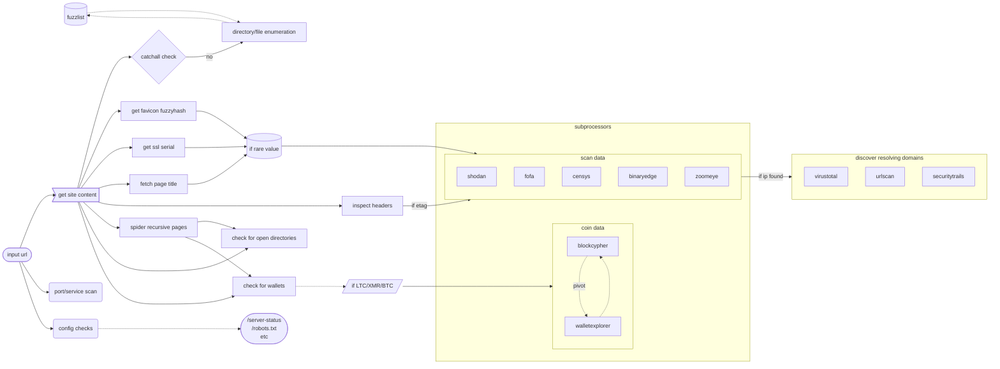

# bebop

---

bebop uncloaks misconfigured web services, helping with many of the mundane tasks involved in revealing the backends of onion services _(Tor)_ and locations fronted by cdn's _(Cloudflare)_



# methods

- favicon detection
- etag detection
- response header analysis (return rare/interesting headers)
- technology identification (port scanning & service identification)
- spidering (return samesite, subdomain and external URLs)
- open directory checks
- webpage title extraction
- email extraction
- wallet extraction & balance fetching (xmr,btc,eth)
- certificate trailing (serial lookup)

# technicals

## prerequisites

a Tor routable SOCKS5 proxy is required if you are scanning a `.onion` address. to establish one, create your own (see [wiki.archlinux.org](https://wiki.archlinux.org/title/tor)) or follow one of the below options;

1. create a single Tor proxy with [joshhighet/torsocc](https://github.com/joshhighet/torsocc/pkgs/container/torsocc)

    ```shell
    docker run -p9050:9050 ghcr.io/joshhighet/torsocc:latest
    ```

2. if you plan on scaling up scans, see [joshhighet/multisocks](https://github.com/joshhighet/multisocks) to minimise any bottleknecks with hsdir resolutions

    ```shell
    git clone https://github.com/joshhighet/multisocks
    docker compose --file multisocks/docker-compose.yml up --detach
    ```
    
by default, the proxy location is set to `host.docker.internal:9050` - this can be overwrote through environment variables, refer to the `building` section for more

### config checks

[configcheck.py](app/configcheck.py) is an extensible set of page-based checks. the list `interesting_paths` defines various checks

each check should consist of three elements, and will look similar to the below 

```python
{'uri': '/server-status', 'code': 200, 'text': 'Apache'},
```

if the response object is unknown or there is uncertainty with string-matches, use `None` as the value for `text`

  - the URI
  - the expected response status code
  - a string expected within the page source

### cryptocurrency

field extractions for bitcoin, monero and ethereum - leveraging blockcypher & walletexplorer for balance checks and pivoting

### favicon

[favicon.py](app/favicon.py) will attempt to find a favicon on the webpage

- the favicon discovery will attempt to parse the icon from any HTML, falling back to hardcoded paths
- if found, the favicon is downloaded and an [MurmurHash](https://commons.apache.org/proper/commons-codec/apidocs/org/apache/commons/codec/digest/MurmurHash3.html) is computed
- the hash is searched against the following engines where credentials are provided
`shodan:http.favicon.hash`, `censys:services.http.response.favicons.md5_hash`, `binaryedge:web.favicon.mmh3` & `zoomeye:iconhash`

_to avoid noise, a list of the top 200 favicons have been added to this repository - if a finding is matched, it will not be considered unique - see the housekeeping section for details_

### domain finder

> :warning: to be completed

[finddomains.py](app/finddomains.py) attempts to try find domains resolving to a given IP address. it relies on four methods (rDNS, VisusTotal, urlscan & SecurityTrails)

for any domains found, they are resolved over Tor and noted if matching the target

### cert fetcher

[getcert.py](app/getcert.py) will request and parse out SSL information where it exists (alt/common names, issuer, subject, etc)

it will also attempt to discover the SSL serial and if deemed globally rare, poll shodan/censys/binaryedge/zoomeye/fofa for sightings

### headers

[headers.py](app/headers.py) does some light analysis on response headers. there are four key outputs

- `etag` - is a server etag is found, it is searched against
- `server` - the value for the `Server` HTTP header
- `cookies` - any cookies dropped by the server during the request
- `interesting_headers` - any rare/interesting headers. essentially the response headers with exclusions - see [headers.txt](app/common/headers.txt)

### open directories

[opendir.py](app/opendir.py) is a simple check that attempts to ascertain wether the current pgae is an open directory

the current implementation simply looks for the string `Index of` within a given pages source.

this is used in conjunction with the spider. i.e get all urls, check for directories

### page spider

[pagespider.py](app/pagespider.py) parses the source code of a webpage and returns two objects;

- URL's contained within the source on the same FQDN
- URL's contained within the source on an alternate domain or subdomain
- emails contained within the source

### port scanning

[portscan.py](app/portscan.py) leverages nmap, [proxychains-ng](https://github.com/rofl0r/proxychains-ng) and [yq](https://github.com/kislyuk/yq)

- yq is used to turn the XML outputted by nmap into JSON 🥴
- unless specified only the top ten ports are scanned
- the full command ran can be seen here on [explainshell](https://explainshell.com/explain?cmd=nmap+-sT+-PN+-n+-sV+--version-intensity+3+--script+ssh-hostkey%2Cbanner%2Chttp-title+--script-args+http.useragent%3D%22USERAGENT%22%2Cssh_hostkey%3Dall+--top-ports+20)

a number of nse scripts are used - these include
- [ssh-hostkey](https://nmap.org/nsedoc/scripts/ssh-hostkey.html)
- [banner](https://nmap.org/nsedoc/scripts/banner.html)
- [http-title](https://nmap.org/nsedoc/scripts/http-title.html)
- [ssh-auth-methods](https://nmap.org/nsedoc/scripts/ssh-auth-methods.html)

### title

[title.py](app/title.py) simply parses the site title out of a page. the text you see on a tab ? that thing

# building

_at build time you can inject a custom proxy location with `SOCKS_HOST` & `SOCKS_PORT`_

```shell
git clone https://github.com/joshhighet/bebop
docker build --build-arg SOCKS_HOST=10.20.30.40 --build-arg SOCKS_PORT=8080 bebop -t bebop
```

# running

## external services

if given credentials, binaryedge, censys, shodan & zoomeye can be used to for enrichment, see the above diagram for specific use criteria

_using one, any or all external data repositories is optional and only done when authorisation parameters are explicitly provided_

| Search Provider   | Environment Variable                  | Where to Find                                                                                    |
|-------------------|---------------------------------------|--------------------------------------------------------------------------------------------------|
| Censys            | `CENSYS_API_ID` & `CENSYS_API_SECRET` | [search.censys.io/account/api](https://search.censys.io/account/api)                             |
| Shodan            | `SHODAN_API_KEY`                      | [account.shodan.io](https://account.shodan.io)                                                   |
| FOFA              | `FOFA_API_KEY`                        | [en.fofa.info](https://en.fofa.info/userInfo)                                                    |
| BinaryEdge        | `BINARYEDGE_API_KEY`                  | [app.binaryedge.io/account/api](https://app.binaryedge.io/account/api)                           |
| ZoomEye           | `ZOOMEYE_API_KEY`                     | [zoomeye.org/profile](https://www.zoomeye.org/profile)                                           |
| urlscan           | `URLSCAN_API_KEY`                     | [urlscan.io/user/profile](https://urlscan.io/user/profile/)                                      |
| VirusTotal        | `VIRUSTOTAL_API_KEY`                  | [support.virustotal.com](https://support.virustotal.com/hc/en-us/articles/115002100149-API)      |
| SecurityTrails    | `SECURITYTRAILS_API_KEY`              | [securitytrails.com/app/account/credentials](https://securitytrails.com/app/account/credentials) |

:note: FOFA does not have a free API tier. All searches require F credits, excluding `icon_hash` searches which require a business plan.


```shell
# if you have already built the image locally
docker run bebop facebookwkhpilnemxj7asaniu7vnjjbiltxjqhye3mhbshg7kx5tfyd.onion
# or to run directly from ghcr
docker run ghcr.io/joshhighet/bebop:latest ciadotgov4sjwlzihbbgxnqg3xiyrg7so2r2o3lt5wz5ypk4sxyjstad.onion
# use -e to inject environment variables, i.e
docker run -e SOCKS_HOST=yourproxy.fqdn -e SOCKS_PORT=8080 -e ZOOMEYE_API_KEY=12345678 -e {any other external service key=values} bebop {...}
# to run directly with python simply have the required environment variables exposed to your shell and run
python3 -m app facebookwkhpilnemxj7asaniu7vnjjbiltxjqhye3mhbshg7kx5tfyd.onion
```

## subprocessors

you can use [get-api-allowances.py](get-api-allowances.py) to retrieve search query credit balances from the engines you utilise.

```
x:bebop (main*) $ ./get-api-allowances.py
############# ZoomEye
359871 remaining credits
############## BinaryEdge
used 220 out of 250 available credits - 30 remaining
################ fofa
coins: 0
points: 9666
remaining queries: 0
remaining data: 0
############## Shodan
99 query credits remaining for current month
############## Censys
used 31 of 250 available queries for current month - 219 remaining
############## SecurityTrails
used 23 of 50 avail credits for current month
############## urlscan.io
used 0 out of 120 avail credits for current minute
used 0 out of 1000 avail credits for current hour
used 11 out of 1000 avail credits for today
############## VirusTotal
used 23 out of 500 avail credits for today
used 0 out of 240 avail credits for current hour
used 23 out of 1000000000 avail credits for current month
```

# housekeeping

to avoid consuming unneccesary credits polling subprocessors a list of common results for a few tasks are stored as text files within this repo.

this includes a list of the top 1000 favicon fuzzyhashes, top 1500 ssl serials and the top 1000 server titles - if a match is found against these, it's unlikely to be a useful enough data-point to bother polling the likes of <todo> for

these files should be updated every now and then. to do so, run the following

```shell
# for favicons
shodan stats --facets http.favicon.hash:1000 port:80,443 \
| grep -oE '^[-]?[0-9]+' \
> common/favicon-hashes.txt
echo 0 >> common/favicon-hashes.txt
# for http titles
shodan stats --facets http.title:1000 port:80,443 \
| grep -oE '^[^0-9]+' \
| sed -r 's/^[[:space:]]+//;s/[[:space:]]+$//' \
| sed '/^[[:space:]]*$/d' \
> common/http-titles.txt
echo '404 Error Page' >> common/http-titles.txt
# for x509 serials
shodan stats --facets ssl.cert.serial:2000 port:443,8443 \
| grep -o '^[^ ]*' \
| sed '/Top/d' \
> common/ssl-serials.txt
```

testcases are a work in progress but can be ran with 

```shell
python3 -m unittest discover -s tests
```
