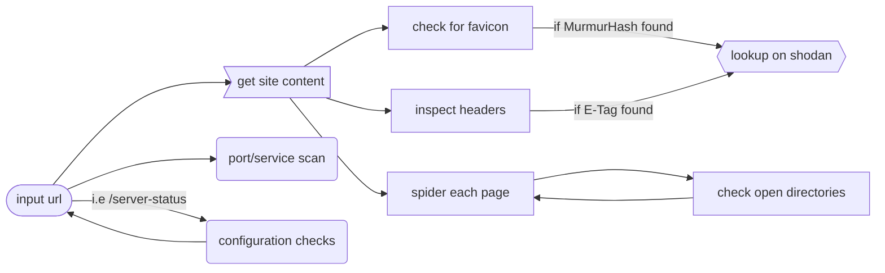

# bebop

:construction: _this project is a work in progress under active development_

---

inspired by the now defunct [onionscan](https://github.com/s-rah/onionscan), bebop is a collection of checks that attempt to reveal and uncloak hidden services

this is aimed to help expedite mundane checks when investigating onion services and locations fronted by cdn's



# methods

- favicon detection (+shodan)
- etag detection (+shodan)
- response header analysis (return rare/interesting headers)
- technology identification (port scanning & service identification)
- url spidering (open directory checks)
- webpage title extraction

# technicals

## prerequisites

you will need to make a Tor routable SOCKS5 proxy available to this image

leverage any existing infrastructure, create your own or follow one of the below methods

1. create a simple single-relay proxy with [joshhighet/gotham/torproxy](https://github.com/joshhighet/gotham/pkgs/container/gotham%2Ftorproxy)

    ```shell
    docker run -p9050:9050 ghcr.io/joshhighet/gotham/torproxy:latest
    ```

2. making a large number of requests? - consider leveraging [joshhighet/multisocks](https://github.com/joshhighet/multisocks), an haproxy balanced relay framework

    ```shell
    git clone https://github.com/joshhighet/multisocks
    docker compose --file multisocks/docker-compose.yml up --detach
    ```
    
by default, the proxy location is set to `host.docker.internal:9050` - this can be overwrote through environment variables, refer to the `building` section for more

### dockerfile

the [dockerfile](app/dockerfile) is fairly stock standard aside from a set of `sed` commands

these are used to modify the location of the target SOCKS proxy within [proxychains.conf](app/proxychains.conf)

you may need to alter the target SOCKS proxy location - this can bbe done with environment variables `SOCKS_HOST` & `SOCKS_PORT`

### page spider

[pagespider.py](app/pagespider.py) simply parses the given source code and returens two objects;

- URL's contained within the source on the same FQDN
- URL's contained within the source on an alternate domain or subdomain

### config checks

[configcheck.py](app/configcheck.py) is an extensible set of page-based checks. the list `interesting_paths` defines various checks

each check should consist of three elements, and will look similar to the below 

```python
{'uri': '/server-status', 'code': 200, 'text': 'Apache'},
```

if the response object is unknown or there is uncertainty with string-matches, use `None` as the value for `text`

  - the URI
  - the expected response status code
  - a string expected within the page source

### favicon

[favicon.py](app/favicon.py) will attempt to find a favicon on the webpage

- the favicon discovery will attempt to parse the icon from any HTML, falling back to hardcoded paths
- if found, the favicon is downloaded and an [MurmurHash](https://commons.apache.org/proper/commons-codec/apidocs/org/apache/commons/codec/digest/MurmurHash3.html) is computed
- the hash is searched against shodan with the `http.favicon.hash` - matches are returned

_to avoid noise, a list of the top 200 favicons have been added to this repository - if a finding is matched, it will not be considered unique_

this may need updating every now and then. to do so, run the following

```shell
shodan stats --facets http.favicon.hash:200 port:80 \
| grep -oE '^[-]?[0-9]+' > common/favicon-hashes.txt
```

### headers

[headers.py](app/headers.py) does some light analysis on response headers. there are four key outputs

- `etag` - is a server etag is found, it is searched against shodan
- `server` - the value for the `Server` HTTP header
- `cookies` - any cookies dropped by the server during the request
- `interesting_headers` - any rare/interesting headers. essentially the response headers with exclusions - see [headers.txt](app/common/headers.txt)

### port scanning

[torscan.py](app/torscan.py) leverages nmap, [proxychains-ng](https://github.com/rofl0r/proxychains-ng) and [yq](https://github.com/kislyuk/yq)

- yq is used to turn the XML outputted by nmap into JSON
- unless specified only the top ten ports are scanned
- the full command ran can be seen here on [explainshell](https://explainshell.com/explain?cmd=nmap+-sT+-PN+-n+-sV+--version-intensity+3+--script+ssh-hostkey%2Cbanner%2Chttp-title+--script-args+http.useragent%3D%22USERAGENT%22%2Cssh_hostkey%3Dall+--top-ports+200)

a number of nse scripts are used - these include
- [ssh-hostkey](https://nmap.org/nsedoc/scripts/ssh-hostkey.html)
- [banner](https://nmap.org/nsedoc/scripts/banner.html)
- [http-title](https://nmap.org/nsedoc/scripts/http-title.html)
- [ssh-auth-methods](https://nmap.org/nsedoc/scripts/ssh-auth-methods.html)

### open directories

[opendir.py](app/opendir.py) is a simple check that attempts to ascertain wether the current pgae is an open directory

the current implementation simply looks for the string `Index of` within a given pages source.

this is used in conjunction with the spider. i.e get all urls, check for directories

### title

[title.py](app/title.py) simply parses the site title out of a page. the text you see on a tab ? that thing

# building

_at build time you can inject a custom proxy location with `SOCKS_HOST` & `SOCKS_PORT`_

```shell
git clone https://github.com/joshhighet/bebop
docker build --build-arg SOCKS_HOST=10.20.30.40 --build-arg SOCKS_PORT=8080 bebop/app -t bebop
```

# running

if you have already built the image locally, run

```shell
docker run bebop facebookwkhpilnemxj7asaniu7vnjjbiltxjqhye3mhbshg7kx5tfyd.onion
```

run from ghcr with the below

unless specified (like below) the SOCKS5 proxy will default to `host.docker.internal:9050`

if no `SHODAN_API_KEY` var is supplied searches will be skipped

```shell
docker run \
-e SOCKS_HOST=yourproxy.fqdn \
-e SOCKS_PORT=9050 \
-e SHODAN_API_KEY=yourkey \
ghcr.io/joshhighet/bebop:latest http://test-web.busmori.com
```